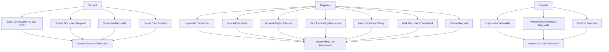
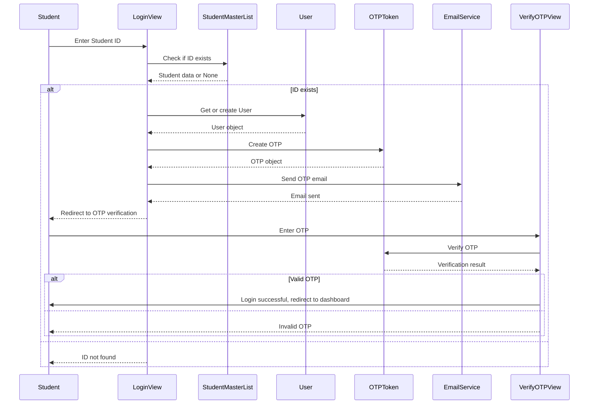
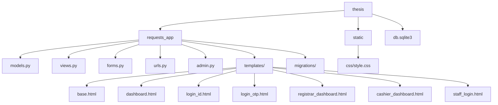

# System Diagrams in Mermaid Syntax

These diagrams are based on the Django web application for student document requests. Each section contains Mermaid code that can be pasted directly into the [Mermaid Live Editor](https://mermaid.live).

## Use Case Diagram



## Class Diagram

```mermaid
classDiagram
    class User {
        +username: CharField
        +email: EmailField
        +groups: ManyToMany
    }

    class StudentMasterList {
        +student_id: CharField
        +full_name: CharField
        +course: CharField
        +major: CharField
        +email: EmailField
        +phone_number: CharField
    }

    class OTPToken {
        +user: ForeignKey
        +otp_code: CharField
        +created_at: DateTimeField
        +is_verified: BooleanField
        +generate_code()
    }

    class DocumentType {
        +name: CharField
        +price: DecimalField
    }

    class DocumentRequest {
        +student: ForeignKey
        +document_type: ForeignKey
        +reason: TextField
        +status: CharField
        +created_at: DateTimeField
    }

    class Profile {
        +user: OneToOneField
        +must_change_password: BooleanField
    }

    User ||--o{ OTPToken : has
    User ||--o{ DocumentRequest : submits
    User ||--|| Profile : has
    DocumentRequest --> DocumentType : requests
```

## Sequence Diagram (Student Login Flow)



## Package Diagram



## Deployment Diagram

```mermaid
graph TD
    A[Client Browser] --> B[Web Server]
    B --> C[Django Application]
    C --> D[SQLite Database]

    B --> E[Email Service]
    C --> F[Static Files]

    subgraph "Server Environment"
        B
        C
        D
        E
        F
    end
