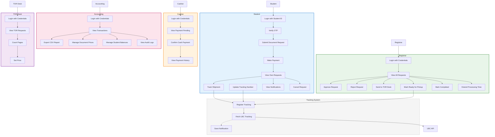

# UML Use Case Diagram - Document Request & Tracking System

```mermaid
graph TD
    %% Actors
    Student[Student]
    Registrar[Registrar]
    Cashier[Cashier]
    Accounting[Accounting]
    TORDesk[TOR Desk]
    System[LBC API]

    subgraph Student_Actor [Student]
        UC1[Login with Student ID]
        UC2[Verify OTP]
        UC3[Submit Document Request]
        UC4[View Own Requests]
        UC5[Track Shipment]
        UC6[Update Tracking Number]
        UC7[View Notifications]
        UC8[Make Payment]
        UC9[Cancel Request]
    end

    subgraph Registrar_Actor [Registrar]
        UC10[Login with Credentials]
        UC11[View All Requests]
        UC12[Approve Request]
        UC13[Reject Request]
        UC14[Send to TOR Desk]
        UC15[Mark Ready for Pickup]
        UC16[Mark Completed]
        UC17[Extend Processing Time]
    end

    subgraph Cashier_Actor [Cashier]
        UC18[Login with Credentials]
        UC19[View Payment Pending]
        UC20[Confirm Cash Payment]
        UC21[View Payment History]
    end

    subgraph Accounting_Actor [Accounting]
        UC22[Login with Credentials]
        UC23[View Transactions]
        UC24[Export CSV Report]
        UC25[Manage Document Prices]
        UC26[Manage Student Balances]
        UC27[View Audit Logs]
    end

    subgraph TORDesk_Actor [TOR Desk]
        UC28[Login with Credentials]
        UC29[View TOR Requests]
        UC30[Count Pages]
        UC31[Set Price]
    end

    subgraph Tracking_System [Tracking System]
        UC32[Register Tracking]
        UC33[Fetch LBC Tracking]
        UC34[Save Notification]
    end

    %% Relationships
    Student --> UC1
    UC1 --> UC2
    UC2 --> UC3
    UC3 --> UC8
    UC8 --> UC4
    UC4 --> UC5
    UC5 --> UC32
    UC32 --> UC33
    UC33 -.-> UC34
    UC6 --> UC32
    UC4 --> UC7
    UC4 --> UC9

    Registrar --> UC10
    UC10 --> UC11
    UC11 --> UC12
    UC11 --> UC13
    UC11 --> UC14
    UC11 --> UC15
    UC11 --> UC16
    UC11 --> UC17

    Cashier --> UC18
    UC18 --> UC19
    UC19 --> UC20
    UC20 --> UC21

    Accounting --> UC22
    UC22 --> UC23
    UC23 --> UC24
    UC23 --> UC25
    UC23 --> UC26
    UC23 --> UC27

    TORDesk --> UC28
    UC28 --> UC29
    UC29 --> UC30
    UC30 --> UC31

    UC15 --> UC32
    UC33 --> System

    style Student_Actor fill:#e3f2fd,stroke:#1976d2,stroke-width:2px
    style Registrar_Actor fill:#e8f5e9,stroke:#388e3c,stroke-width:2px
    style Cashier_Actor fill:#fff3e0,stroke:#f57c00,stroke-width:2px
    style Accounting_Actor fill:#fce4ec,stroke:#c2185b,stroke-width:2px
    style TORDesk_Actor fill:#f3e5f5,stroke:#7b1fa2,stroke-width:2px
    style Tracking_System fill:#f5f5f5,stroke:#616161,stroke-width:1px,stroke-dasharray:5 5
```
